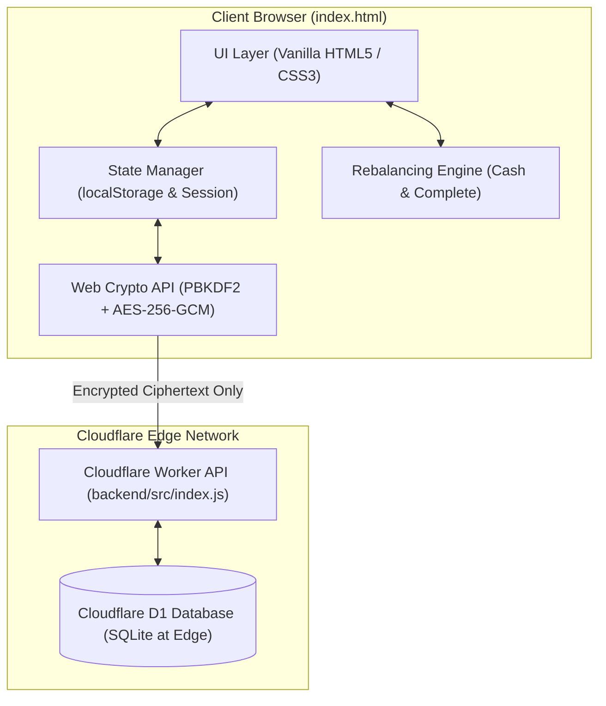

# Architecture & Codebase Technical Guide

This document provides a comprehensive breakdown of the Portfolio Rebalancer codebase, its architectural principles, cryptographic mechanisms, mathematical algorithms, and testing invariants.

---

## 1. System Overview & Philosophy

The Portfolio Rebalancer is a **privacy-first, client-side, zero-knowledge portfolio optimization platform**. 



### Guiding Principles:
1. **Zero-Knowledge Privacy:** The server never receives raw financial data, holding tickers, quantities, or the user's master password. All portfolio data is encrypted client-side using AES-256-GCM before syncing to the cloud.
2. **Local-First Resilience:** The application is fully functional offline without an internet connection or backend account. Local storage mirrors cloud state.
3. **Deterministic Math:** Rebalance allocations strictly adhere to mathematical invariants (total funds conserved down to the exact cent, weights sum to 100%, zero negative purchases).
4. **Zero-Dependency Core:** The frontend runs on pure modern HTML5, CSS3, and Vanilla JavaScript without bloated frameworks (React, Vue, Webpack) or runtime dependencies.

---

## 2. Directory & File Breakdown

```
Rebalancing/
├── index.html                  # Root distribution file (kept in 100% parity with GitHub)
├── docs/
│   ├── ARCHITECTURE.md         # This technical specification
│   └── PRO_TIER_SPEC.md        # Monetization, pricing, and MoR specifications
└── GitHub/Rebalance/
    ├── index.html              # Primary source file for the Single-Page Application (SPA)
    ├── backend/
    │   ├── src/
    │   │   └── index.js        # Cloudflare Worker API edge handler
    │   ├── schema.sql          # Cloudflare D1 SQL schema (accounts, reset tokens)
    │   ├── wrangler.toml       # Cloudflare deployment configuration
    │   └── package.json        # Miniflare / Wrangler testing dependencies
    └── tests/
        ├── master_test_suite.js    # 111 deterministic unit & integration tests
        ├── backend_test_suite.js   # 23 Cloudflare Worker edge & SQL tests
        ├── fuzz_invariant_suite.js # Mathematical fuzzing & invariant verification
        ├── test_helper.js          # Mock DOM & Web Crypto browser environment
        └── run_all.js              # Master test runner
```

---

## 3. Frontend Architecture (`index.html`)

The frontend is a single monolithic file designed for high portability, instant loading, and ease of deployment on static hosts (Cloudflare Pages, GitHub Pages, or local `file:///`).

### A. Modular Structure of `index.html`:
1. **Embedded CSS Design System (`<style>`):**
   * Uses CSS Custom Properties (`--bg-primary`, `--surface-card`, `--accent: #24dba1`, `--text-primary`, `--radius-pill`).
   * Seamless light/dark mode theming with smooth transitions (`data-theme="light"` / `data-theme="dark"`).
   * Fully responsive layouts utilizing CSS Grid and Flexbox with mobile media queries.
2. **Accessible HTML5 Markup (`<body>`):**
   * Header with brand tag (`v1.2.2`), account controls, and settings gear.
   * Portfolio Inputs: Total Deposit, Minimum Purchase threshold, and Mode toggles.
   * Holdings Table: Dynamic grid supporting both 5-column (Current Value) and 6-column (Share Price & Quantity) layouts.
   * Output Section: Summary cards, allocation lists, cash remainder alerts, and comparative progress bars.
   * Modals: Settings & Preferences, Authentication (Sign In / Register), Account Management, Emergency Recovery, and Financial Disclaimers.
3. **Embedded JavaScript Application Engine (`<script>`):**
   * Reactive state synchronization via `saveFormData()` and `loadFormData()`.
   * Input formatting, currency conversions, and DOM rendering.
   * Rebalancing mathematical algorithms.

### B. Dual Input Mode Architecture
Users can toggle between two primary holding input modes in **Settings -> Preferences**:

```mermaid
flowchart LR
    Toggle{"Input Mode Setting"}
    Toggle -->|Value Mode (Default)| ModeVal["5-Column Grid: [Ticker] [Current Value] [Target %]"]
    Toggle -->|Shares Mode| ModeShares["6-Column Grid: [Ticker] [Share Price] [Quantity] [Target %]"]
    ModeShares --> Calc["Auto-Calculation: Value = Price × Quantity"]
    Calc --> Engine["Rebalancing Engine"]
    ModeVal --> Engine
```

* **Value Mode (Default):** Direct monetary value input (`#val-X`). Ideal for multi-asset funds, dollar-based accounts, or quick rebalancing.
* **Shares Mode:** Two separate fields: **Share Price** (`#price-X`) and **Quantity** (`#qty-X`).
  * Current value is automatically calculated: $\text{Current Value} = \text{Share Price} \times \text{Quantity}$.
  * Supports fractional shares and fractional prices (`step="any"`).
  * State transitions preserve calculated current values when toggling between modes.

### C. Rebalancing Calculation Engines
1. **Standard Cash-Injection Rebalance (Buys Only):**
   * Injects new cash deposit without selling existing holdings.
   * Iteratively allocates funds to the most underweight assets until targets are reached or funds are exhausted.
   * Enforces `minBuy` threshold: Any purchase smaller than `minBuy` is suppressed to avoid inefficient micro-trades.
2. **Complete Rebalance (Buys and Sells):**
   * Reallocates the entire portfolio plus deposit to match target percentages perfectly.
   * Calculates precise sell amounts for overweight assets and buys for underweight assets.
3. **Conserving Whole-Dollar Rounding (Hamilton-Hare / Largest Remainder Method):**
   * When whole-number rounding is enabled, normal rounding (`Math.round`) causes cash leaks or over-spending.
   * Our algorithm uses the **Largest Remainder Method**: Floors all allocations to integer values, sorts fractional remainders in descending order, and distributes remaining whole dollars one by one.
   * **Invariant:** $\sum \text{Allocations} \equiv \text{Deposit}$ (guarantees zero leaked or created pennies).

### D. Comparative Progress Bars
Located in the Rebalance Breakdown output:
* **Track:** A continuous 6px background track (`--track-bg`).
* **Initial Weight Bar (`alloc-bar-start`):** Represents pre-rebalance portfolio weighting.
* **New Weight Bar (`alloc-bar-new`):** Represents post-rebalance weighting in bright mint green (`--accent`).
* **Target Marker (`alloc-target-marker`):** A white vertical indicator positioned at `targetPct%`.

---

## 4. Cryptographic & Security Architecture

```mermaid
sequenceDiagram
    autonumber
    actor User as User Browser
    participant PBKDF2 as Web Crypto PBKDF2
    participant AES as AES-256-GCM Engine
    participant Edge as Cloudflare Worker API
    participant D1 as D1 Database

    Note over User: User enters Email & Master Password
    User->>PBKDF2: Derive 256-bit Master Key (Salt = Email, 100k iterations)
    PBKDF2-->>User: Master CryptoKey
    User->>User: Compute authHash = SHA-256(MasterKeyHex)

    rect rgb(30, 40, 50)
        Note over User,AES: Local Vault Encryption
        User->>AES: Encrypt Portfolio JSON with MasterKey (12-byte IV)
        AES-->>User: vaultCiphertext (Base64)
    end

    User->>Edge: PUT /api/vault { email, authHash, vaultCiphertext }
    Edge->>D1: Verify authHash against accounts table
    alt Auth Valid
        Edge->>D1: UPDATE accounts SET vault_ciphertext = ?
        Edge-->>User: 200 OK (Sync Successful)
    else Auth Invalid
        Edge-->>User: 401 Unauthorized
    end
```



### Key Security Specifications:
* **Key Derivation:** PBKDF2 with **100,000 iterations of HMAC-SHA-256**. The salt is the normalized email address.
* **Symmetric Encryption:** **AES-256-GCM** with a cryptographically secure, randomized 12-byte initialization vector (IV) prepended to the ciphertext.
* **Zero-Knowledge Authentication:** The server never receives the Master Password or derived Master Key. The client transmits `authHash = SHA-256(rawKeyHex)`. Compromise of the server database reveals only auth hashes that cannot be reversed to decrypt vaults.
* **Emergency Recovery Key:** 24-character high-entropy Base32 recovery key (`rebalance-recover-XXXX-XXXX-XXXX`). Stored in an encrypted recovery envelope decryptable only by the recovery key.
* **Clean Slate Account Reset (Option B):**
  * When a user forgets their password and loses their recovery key, they can wipe their unreadable encrypted vault and reset credentials without losing their subscription.
  * **Free Tier:** Verified via 6-digit email OTP.
  * **Pro Tier:** Verified via **both** 6-digit email OTP **and** the **Last 4 Digits of the Payment Card on File** (defends against email takeover attacks).
  * Rate limited to **3 requests per hour** with a maximum of **3 failed attempts** before token revocation.

---

## 5. Backend Architecture (`backend/`)

Hosted on **Cloudflare Workers** with **Cloudflare D1** (distributed SQLite at the edge).

### Database Tables (`backend/schema.sql`):
1. **`accounts` Table:**
   * `email` (PRIMARY KEY)
   * `auth_hash` (Client-derived SHA-256 hash)
   * `schema_version` (Default 2)
   * `vault_version` (Monotonically incrementing sync counter)
   * `vault_ciphertext` (Base64-encoded encrypted vault)
   * `recovery_envelope` (Encrypted master key backup)
   * `tier` (`'free'` | `'pro'`)
   * `stripe_customer_id` (Customer ID from payment processor)
   * `subscription_status` (`'none'` | `'active'` | `'cancelled'` | `'expired'`)
   * `subscription_expires_at` (ISO timestamp)
2. **`password_reset_tokens` Table:**
   * Tracks temporary 6-digit OTP tokens for Clean Slate resets with 15-minute expiration and brute-force attempt counters.

### Security Defenses:
* **Anti-Enumeration:** Registration and reset requests return identical generic success messages regardless of whether the email exists in the database.
* **Prepared SQL Statements:** All queries use parameterized bindings (`env.DB.prepare().bind().run()`), eliminating SQL injection.
* **Payload Limits:** Rejects requests larger than 64KB with HTTP 413.

---

## 6. Automated Testing Architecture (`tests/`)

Testing is strictly deterministic and executes in Node.js using custom mock environments without heavyweight browser drivers.

| Test Suite | File | Tests | Focus Area |
| :--- | :--- | :---: | :--- |
| **Master Deterministic Suite** | `tests/master_test_suite.js` | **111** | Core math, DOM rendering, whole-dollar rounding, storage persistence, Clean Slate flows, and Shares Mode. |
| **Backend Edge Suite** | `tests/backend_test_suite.js` | **23** | Cloudflare Worker endpoints, D1 SQL queries, OTP rate limiting, billing challenges, and anti-enumeration. |
| **Fuzz Invariant Suite** | `tests/fuzz_invariant_suite.js` | **Fuzz** | Property-based randomized fuzzing verifying cash-conservation and non-negativity invariants across millions of permutations. |

### Running the Tests:
```powershell
node tests/master_test_suite.js    # Runs all 111 frontend & DOM unit tests
node tests/backend_test_suite.js   # Runs all 23 Cloudflare Worker edge tests
node tests/run_all.js              # Executes complete end-to-end verification
```

---

## 7. Development Guidelines & Commitments

1. **Strict 0-Diff Parity:**
   Any change made to `GitHub/Rebalance/index.html` must be immediately mirrored to `c:\Users\willi\Desktop\Rebalancing\index.html`.
2. **Git Workflow:**
   * All active development occurs on branch `dev`.
   * **NEVER push to remote git.** Local commits are made on `dev`; the user controls when to push to GitHub.
3. **Testing Gate:**
   No feature or refactor is considered complete until all 134 automated tests pass with 100% success.
