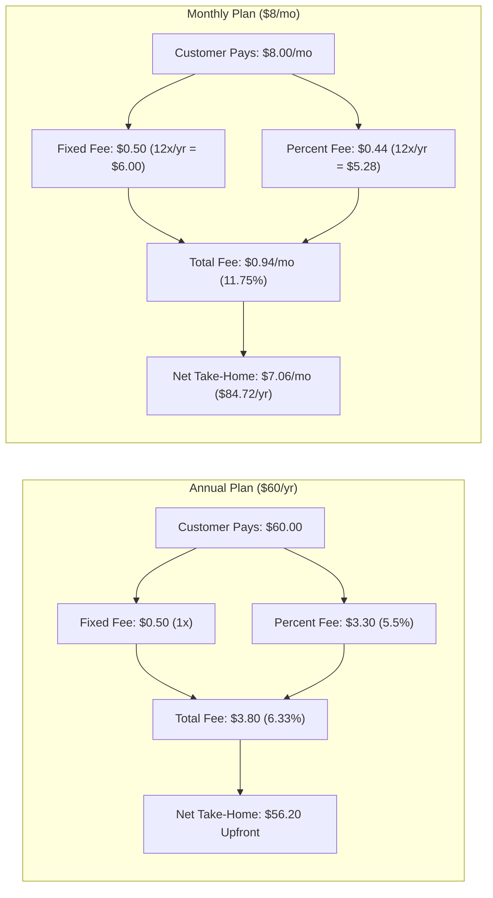

# Pro Tier Specification & Monetization Blueprint

This document defines the product tiering, pricing strategy, economic modeling, and payment infrastructure for the Portfolio Rebalancer. It serves as the single source of truth for all future development relating to paid accounts, subscriptions, and billing.

---

## 1. Product Tiering Philosophy: "Never Paywall the Math"

### Core Principle
> **Never paywall arithmetic. Paywall convenience, ongoing compute, external API costs, and scale.**

Calculating fractional shares, rounding whole shares, or determining optimal allocations costs \$0.00 in compute and runs entirely on the user's browser. Artificially crippling the mathematical engine or forcing a cash remainder behind a paywall creates immediate backlash, negative reviews, and prompts users to revert to spreadsheets. 

Trust is our primary growth engine. The free tier must remain mathematically complete, privacy-respecting, and exceptionally useful on its own.

### Feature Matrix

| Feature | Free Tier | Pro Tier | Rationale |
| :--- | :---: | :---: | :--- |
| **Mathematical Engine** | **Full & Unrestricted** | **Full & Unrestricted** | Pure client-side math; builds trust and organic word-of-mouth. |
| **Input Modes** | Current Value **&** Price/Quantity | Current Value **&** Price/Quantity | Both whole share rounding and fractional share division are free. |
| **Rebalance Types** | Cash Injection **&** Complete Rebalance | Cash Injection **&** Complete Rebalance | Core utility is unrestricted. |
| **Client-Side Privacy** | Zero-Knowledge PBKDF2/AES-GCM | Zero-Knowledge PBKDF2/AES-GCM | Privacy is a fundamental human right, not a luxury feature. |
| **Portfolios Count** | **1 Portfolio** | **Unlimited Portfolios** | Multi-portfolio isolation (Retirement, Taxable, Spouse, Crypto). |
| **Holdings Capacity** | Up to **8 Holdings** | **Unlimited Holdings** | Accommodates complex portfolios without penalizing simple 3-fund investors. |
| **Market Data** | Manual Entry | **Live Market Price Feeds** | External API costs (e.g. TwelveData/FMP/Finnhub) require subscription funding. |
| **Portfolio Monitoring** | Manual Check | **Automated Drift Alerts** | Daily Cloudflare Worker cron monitoring and transactional emails (Resend). |
| **Cloud Vault Sync** | Single Device Mirror | **Seamless Multi-Device Sync** | Cloud storage and encrypted sync across desktop and mobile browsers. |

---

## 2. Pricing Structure & Anchor Economics

Rebalancing is an **intermittent activity** (conducted monthly, quarterly, or bi-annually). Relying purely on month-to-month billing results in high seasonal churn (subscribing for 1 month, rebalancing, and canceling). 

To solve this, we use **Price Anchoring**:

| Plan | Customer Price | Framing / Value Anchor | Effective Monthly Cost |
| :--- | :--- | :--- | :--- |
| **Annual (Default)** | **\$60.00 / year** | **"Save 38% (Get nearly 4 months free!)"** | **\$5.00 / month flat** |
| **Monthly** | **\$8.00 / month** | **"Flexible, cancel anytime"** | **\$8.00 / month** |

### Why This Pairing Works
1. **Clean Cognitive Math:** \$60 / 12 = **\$5.00/month flat**. Users instantly understand the value without cognitive friction.
2. **Portfolio Perspective:** On a modest \$20,000 to \$50,000 portfolio, \$60/year is only **0.12% to 0.30%** of assets—vastly cheaper than financial advisors (1.00%) or heavy tracking tools (\$100–\$150/year).
3. **High Upfront LTV:** The \$36 annual savings strongly nudges 80%+ of converting users into the \$60 upfront plan, completely eliminating monthly churn and providing upfront cash flow.

---

## 3. Merchant of Record (MoR) Architecture: Lemon Squeezy

We use **Lemon Squeezy** (acquired by **Stripe** in July 2024) as our **Merchant of Record (MoR)**.

### Why an MoR Instead of Standard Stripe?
* **Zero Tax Liability:** Standard Stripe is merely a payment processor; the developer is legally liable for registering, collecting, and filing sales tax/VAT across 50 US states, the EU (VAT OSS), the UK (HMRC), and Australia (GST).
* **Authorized Reseller:** Lemon Squeezy legally acts as the reseller. They calculate, collect, and remit all global taxes under their corporate entity. The developer receives clean, consolidated payouts with zero multi-jurisdiction tax filings.
* **Stripe Infrastructure:** Backed by Stripe's global banking rails, fraud prevention, and uptime.

### Transaction Fee Modeling

Lemon Squeezy charges **5.5% + \$0.50** per recurring subscription transaction (+1.5% for international non-US cards):



### Key Fee Takeaways:
* **The Fixed \$0.50 Fee Punishes Monthly Billing:** On \$8/mo, the \$0.50 fixed charge eats 6.25% of revenue by itself, driving total fees to **11.75%**.
* **Annual Maximizes Margins:** On \$60/yr, the fixed fee is paid only once, keeping total fees down to **6.33%** and leaving **\$56.20 net** on Day 1.
* **The Spread is Justified:** Charging \$8/mo absorbs the \$0.90+ fee drag and covers monthly churn risk, while preserving healthy margins.

---

## 4. Technical Integration Architecture

### Database Schema (Cloudflare D1)
The `accounts` table in `backend/schema.sql` is already configured for subscription tracking:

```sql
CREATE TABLE accounts (
    email TEXT PRIMARY KEY,
    auth_hash TEXT NOT NULL,
    schema_version INTEGER NOT NULL DEFAULT 2,
    vault_version INTEGER NOT NULL DEFAULT 1,
    vault_ciphertext TEXT,
    recovery_envelope TEXT,
    tier TEXT NOT NULL DEFAULT 'free',                 -- 'free' | 'pro'
    stripe_customer_id TEXT,                          -- Lemon Squeezy / Stripe Customer ID
    subscription_status TEXT NOT NULL DEFAULT 'none', -- 'none' | 'active' | 'past_due' | 'cancelled' | 'expired'
    subscription_expires_at TEXT,                     -- ISO timestamp of renewal / expiration
    preferences TEXT NOT NULL DEFAULT '{"currency":"USD","theme":"auto","autoSync":true}',
    created_at TEXT NOT NULL,
    updated_at TEXT NOT NULL,
    last_login_at TEXT NOT NULL
);
```

### Frontend Checkout Flow (`index.html`)
1. User clicks **"Upgrade to Pro"**.
2. Lemon Squeezy's hosted overlay modal is triggered via `lemon.js`:
   ```javascript
   function openLemonCheckout(variantId) {
       const userEmail = currentAccount?.email || '';
       const checkoutUrl = `https://rebalance.lemonsqueezy.com/buy/${variantId}?checkout[email]=${encodeURIComponent(userEmail)}&checkout[custom][user_email]=${encodeURIComponent(userEmail)}`;
       LemonSqueezy.Url.Open(checkoutUrl);
   }
   ```
3. When checkout succeeds, `lemon.js` fires a `Checkout.Success` event in the browser, prompting the client to refresh its session and instantly reveal Pro features.

### Backend Webhook Handler (`backend/src/index.js`)
* **Endpoint:** `POST /api/webhooks/lemonsqueezy`
* **Security:** Verifies the `X-Signature` HMAC-SHA256 header using `crypto.subtle` against `env.LEMONSQUEEZY_WEBHOOK_SECRET`.
* **Events Handled:**
  * `subscription_created` / `order_created`:
    ```sql
    UPDATE accounts 
    SET tier = 'pro', subscription_status = 'active', subscription_expires_at = ? 
    WHERE email = ?;
    ```
  * `subscription_updated`: Updates renewal date or tier.
  * `subscription_cancelled`: Keeps `tier = 'pro'` until `subscription_expires_at`, sets `subscription_status = 'cancelled'`.
  * `subscription_expired`: Reverts `tier = 'free'`, sets `subscription_status = 'expired'`.

### Customer Billing Management (Self-Serve Portal)
* No custom billing management code or credit card update forms are needed in the app.
* Lemon Squeezy provides a hosted **Customer Portal**.
* A simple *"Manage Subscription"* link in Settings -> Account redirects the user to their authenticated Lemon Squeezy billing portal.
